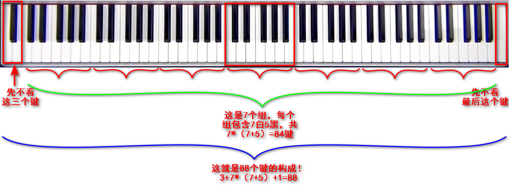
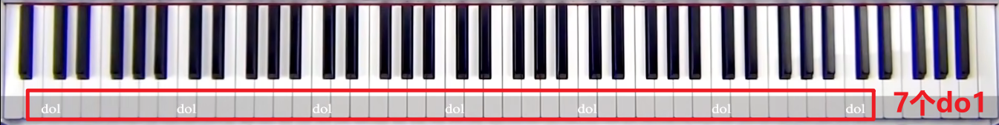
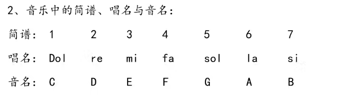

## 键盘组成
1.88键，其中白键52个，黑键36个
## 组成规律
从左到右看
从数字：去除头三个(白黑白)键，和最后的一个白键，剩下的全是7个白键(),5个黑键为一组，共有7组，那就是3+7*(5+7)+1=88，
从音调：这7个组，每一个组都是我们常说的 DO RE MI FA SO LA SI ，且越往右音调越高，从低沉到明亮！

### do1的寻址
尝试在7个组中每一组的两个黑键的左边的第一个键就是do1！

### 中央C
第四个do1就是最中间的，面向你的do1，被称为中央C

**唱名**：我们唱出来的音(DO RE MI FA SO LA SI)，对应的音名为：A B C D E F G

**音名**：仅看白键的话，就是从0~51的 A B C D E F G 的循环，因为刚开始的前两个白键不参与唱名，所以我们的DO就对应的音名C(相当于向右偏移2)

所有的音名C(唱名DO)
.png)

### 坐姿
正对中央C，只坐琴凳的1/3，离琴键大概两拳，身体坐直，脚放平
