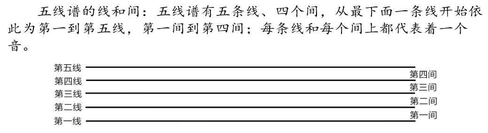

# 简谱
即：1 2 3 4 5 6 7
一般运用在名族乐器中，比如古筝、二胡、竹笛
在钢琴中的运用：

**运用**：给你一个音，你知道在哪里弹奏他，比如给你1上加两个'.',则是C++区的DO！

# 五线谱
即小蝌蚪
一般运用在西洋乐器：大提琴、小提琴、长管、钢琴等
值得一提，钢琴作为乐器之王，两种都可以弹奏
## 认识五线谱

五线谱的五条线和四个间都是一个音，从下向上数依次为一线、二线……，一间、二间……

### 下加线，上加线
因为钢琴共有88个键，共5个线就太短了，所以我们常常**下加一线、上加一线**等……这是我们自己加的线@
但是由于键实在太多了，这要加到什么时候才是头呢？这时间就分出了高音普表，低音普表

### 高音谱号与低音谱号

### 大谱表

恒等式 ：**高音谱表的下加一线**和**低音谱表的上加一线**都是**中央C**
每一个间就是一个音，高音就是往右数，低音就是往左数
