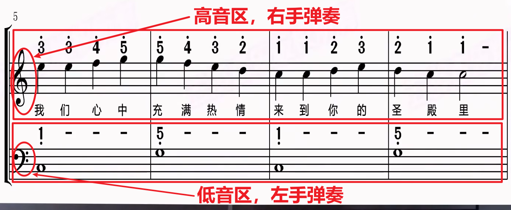
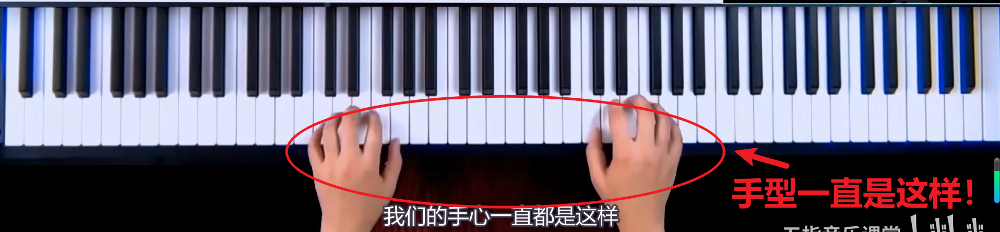
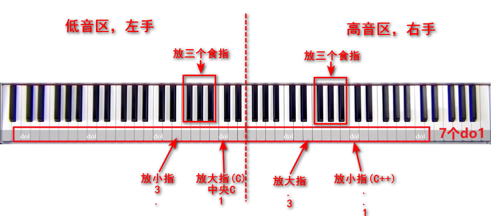
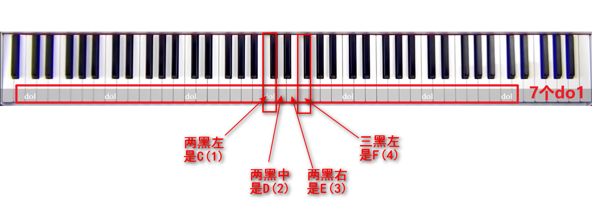

# 高低音谱
### 左右手放置

### 手的姿势
手型一直是这样，像是粘在键上的一样

### 左右手放置位置
左手小指.3 大指放在中央C，三指放在黑键上
右手小指C++. 大指放在3.，三指放在黑键上
如下图:

太妙了，把C和C++结合起来了~~弹钢琴就是编程呀~~~

### 巧记C\F\
#### 其实记住CF的位置就可以直接定位了！
因为黑键很有辨识度，二黑左和三黑左是很好找的！
