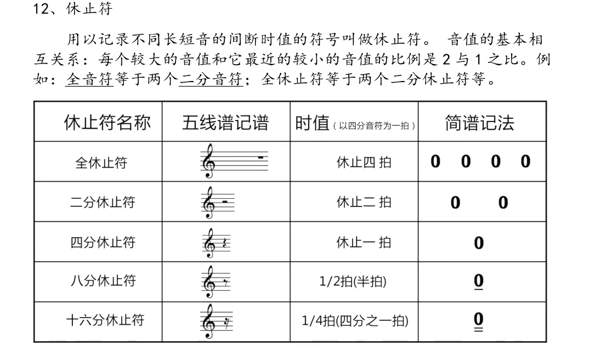
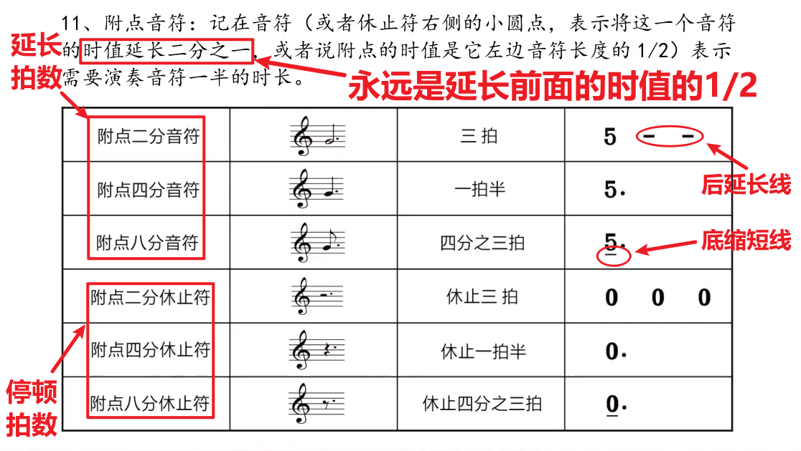

# 4休止音和附点音符
## 休止音
### 定义
就是遇到这个音符，什么都不做，停止弹奏！
注意，这和前面的底下缩短线有明显区别，因为缩短毕竟还有，但是这是完全没有了，停止弹奏了！

## 附点音符
### 定义
就是将前面的音符的作用延长一半！一个点延长一半!不管前面的是休止音还是延长音、缩短音
[img.png](img.png)

---
### 回顾 
#### 延音与缩短音又忘了一点
前面的数字后延长线代表延长节拍、下划线代表缩短节拍、不划线代表一个节拍的知识有点忘了！
以及他们在五线谱上的表示，这是很重要的！