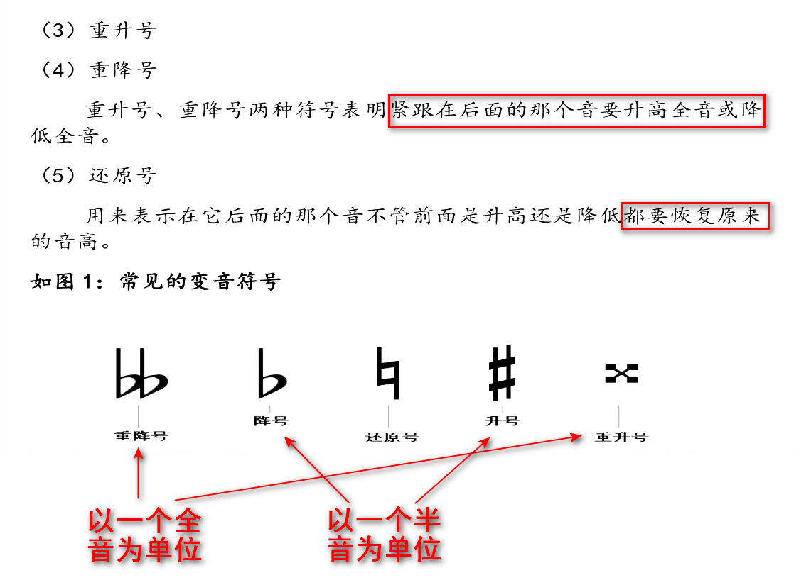
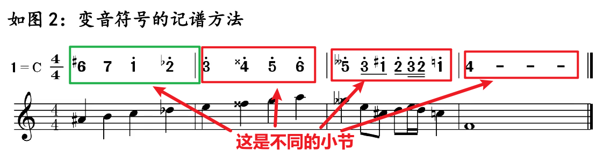

# 全音半音
定义 ：距离单位，隔得最近的两个键之间是半音(包括黑键)，则从1-7里面，白键遵从`全全半全全全半`的特性

---
# 升降音
## 五类: 升音、降音、重升音、重降音、还原音

## 小节符号
作用：用来划分不同节，因为升降号只对同一小节起作用！

---
## 注意：
1.作用范围：升降音只在**本小节**有效，后面遇到不同的，又变了
2.**升降均是半音，重升重降均是全音**